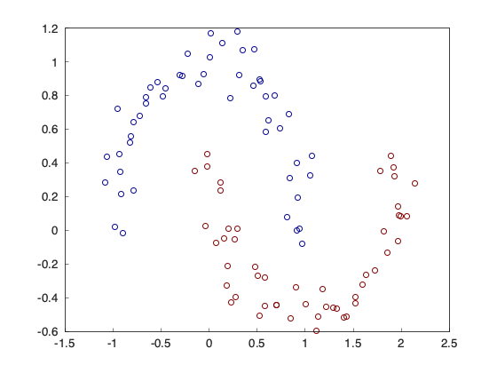
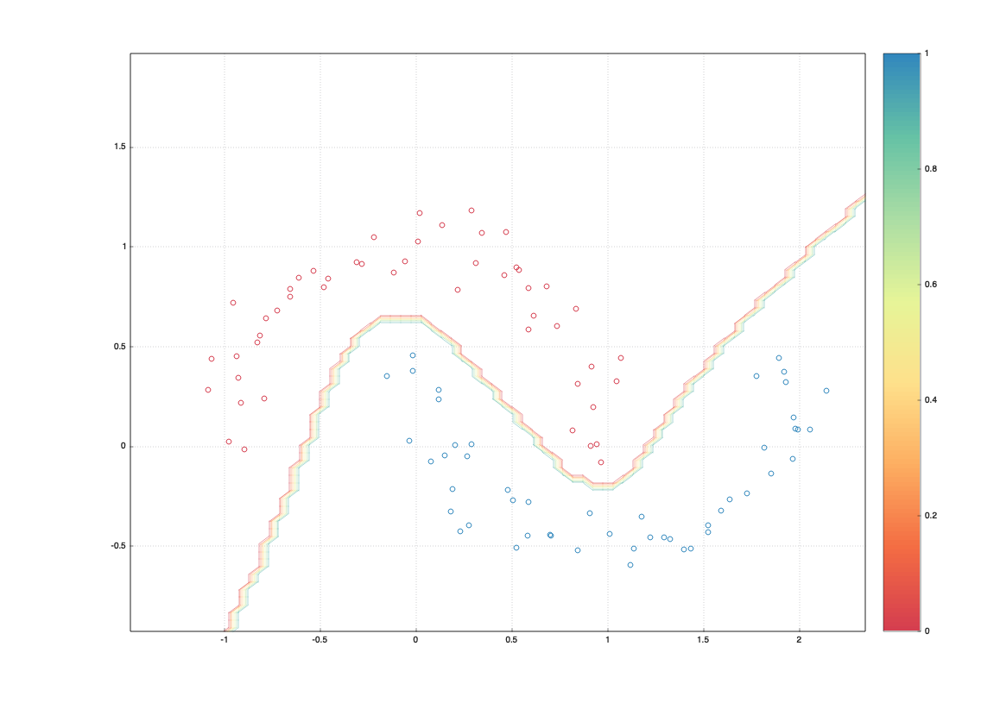

# micrograd-cpp

C++ impl of [micrograd](https://github.com/karpathy/micrograd).

- YouTube: https://www.youtube.com/watch?v=VMj-3S1tku0&list=PLAqhIrjkxbuWI23v9cThsA9GvCAUhRvKZ
- Building an DAG in C++, from operator overrides.
- A node can be shared by multiple children.
- Using smart-pointer to manage memory.

## Prerequisites

You need a C++ dev environment and CMake. I'm using Clang:

```
⋊> ~/C/m/debug on main ⨯ clang --version                                                                                                                                                                                                                          (base) 00:21:10
Apple clang version 15.0.0 (clang-1500.3.9.4)
Target: arm64-apple-darwin23.6.0
Thread model: posix
InstalledDir: /Applications/Xcode.app/Contents/Developer/Toolchains/XcodeDefault.xctoolchain/usr/bin
```

## Building

```
mkdir cmake-build-debug
cd cmake-build-debug && cmake -DCMAKE_BUILD_TYPE=Debug ..
make
./micrograd++
```

## Output

It runs the example in the Video.

```
Preds: [Value(data=0.149048), Value(data=0.853032), Value(data=0.550389), Value(data=0.596208)]
Loss: 6.7246
Preds: [Value(data=0.195786), Value(data=0.836784), Value(data=0.50433), Value(data=0.61548)]
Loss: 6.4314
Preds: [Value(data=0.224787), Value(data=0.815759), Value(data=0.443745), Value(data=0.623476)]
Loss: 6.1241
Preds: [Value(data=0.241228), Value(data=0.789126), Value(data=0.368526), Value(data=0.623298)]
Loss: 5.79148
Preds: [Value(data=0.250003), Value(data=0.756087), Value(data=0.280002), Value(data=0.617303)]
Loss: 5.4312
Preds: [Value(data=0.255546), Value(data=0.716055), Value(data=0.18155), Value(data=0.607584)]
Loss: 5.04911
Preds: [Value(data=0.261507), Value(data=0.668829), Value(data=0.0783758), Value(data=0.596168)]
Loss: 4.65633
...
Preds: [Value(data=0.913115), Value(data=-0.851749), Value(data=-0.907064), Value(data=0.894504)]
Loss: 0.0492936
Preds: [Value(data=0.913604), Value(data=-0.852617), Value(data=-0.90751), Value(data=0.895043)]
Loss: 0.0487563
Preds: [Value(data=0.914085), Value(data=-0.853472), Value(data=-0.907951), Value(data=0.895574)]
Loss: 0.0482298
```

## Replicating the demo




